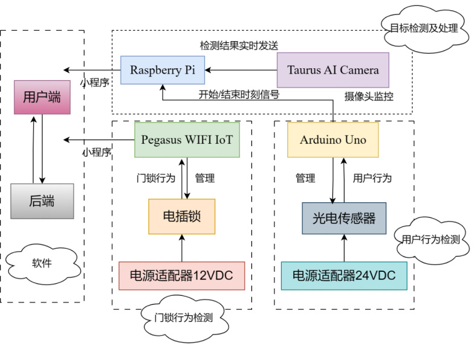

# 无人智能零售柜

## 作品简介

我们的作品是利用Pegasus，Taurus、五线电插锁等部件搭建的无人智能饮料零售柜。本款无人智能零售柜提供了一种更加便捷、智能、节约物资的饮料购买方式，结合Taurus图像检测技术，可以分析得到消费者拿取的产品，自动结算。

## 作品架构

## 工作流程

用户通过小程序点击开门按钮，Pegasus通过WiFi与小程序互联，接受到信号后控制电插锁开门；用户取出饮料后，Arduino接收到光电传感器信号后传递给树莓派；Taurus对饮料进行实时检测，处理后生成购物车传给小程序。

## 代码介绍

code目录主要包括：

（1）pegasus目录:  hi3861代码，负责通过wifi与小程序互联；

（2）taurus目录：hi3516代码，负责进行饮料的图像检测与分类并将结果通过串口传递；

（3）uvm-applet目录：小程序代码；

（4）uvm-backend目录：小程序后端代码；

（5）door_light_recv.ino：Arduino代码，主要负责监测信号并传递信息。